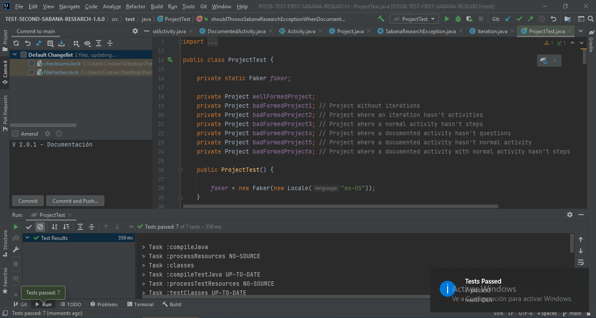
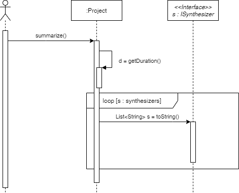

# POOB-TEST-SECOND-SABANA-RESEARCH


## I. (30%) IMPLEMENTANDO


## II. (25%) DISEÑANDO
1. Escriba la especificación (documentación + firma del método) del método.

public String summarize()
* Este método recopilará el resumen del tiempo total de trabajo del proyecto, así como el tiempo de cada estudiante en 
el proyecto y el tiempo que tuvo cada itineración en un String, para seguido imprimirlo en pantalla.
  
2. Construya el diagrama de secuencia.
   


3. Actualice el diagrama de clases con los nuevos elementos (clases, métodos, atributos, relaciones).
   


4. Escriba la especificación (documentación + firma del método) de todos los métodos de apoyo que haya identificado.

toString()
* Imprime

## III. (25%) EXTENDIENDO
1. De los diseños resultantes del punto I y II, ¿Qué debe cambiar? ¿Qué no debe cambiar?. Justifique su respuesta.


## IV. (20%) CONCEPTOS

1. ¿Cuáles son las acciones los tres momentos importantes de las excepciones? ¿Cuál es el objetivo de cada una? 
¿Cómo se implementa en Java cada acción?.
   
Los tres momentos de las excepciones son: 
* Lanzar: Este momento es cuando se inicia una excepción en un método, sirve para mandar la excepción a todos los 
  sistemas que utilicen el método de la excepción. Para su implementación es la palabra reservada `throws`
* Propagar: Este momento es cuando se manda la excepción a los demás sistemas que utilicen el método con la excepción,
  este sirve para llevar el seguimiento de la excepción, para implementarlo se usa la palabra reservada `throw`
* Controlar: Este momento es cuando se quiere hacer alguna acción diferente al salir la excepción, sirve cuando 
se quiere retornar un valor si hay una excepción. La palabra reservada para implementarlo es `try-catch`
2. ¿Qué es sobre-escritura de métodos? ¿Por qué aplicarla? ¿Cómo impedir que se sobre-escriba un método?.

La sobre-escritura de métodos es cuando hay una relación de herencia y el hijo quiere cambiar el funcionamiento de un
método del padre. Se aplica para encapsular funcionamientos unicos para cada clase hija. Para impedir que una clase
sobre-escriba el método se usa el `final`.

## V. (50%) BONO

Implemente pruebas unitarias el código necesario para que las mismas pases sobre el método `summarize()` de la clase
`Project`, asegurese de probar el `ISynthesizer` de tipo `ExecutiveSynthesizer` y `StudentSynthesizer`, para cada uno 
sus casos de éxito y excepciones.

SI REALIZO EL BONO ASEGÚRESE DE INDICARLO EN EL ARCHIVO SOLUTIONS.md.

## Entrega

Siga al pie de la letra estas indicaciones para la entrega de este punto. EL HACER CASO OMISO DE ESTAS INSTRUCCIONES 
PENALIZARÁ LA NOTA.

1. Configure su usuario de GIT

```bash
$ git config --global user.name "Juan Perez"
$ git config --global user.email juan.perez@unisabana.edu.co
```

2. Desde el directorio raíz (donde está este archivo README.md), haga commit de lo realizado. Mantenga su repositorio 
privado hasta después de la entrega del parcial, entonces hagalo publico.

```bash
$ git add .
$ git commit -m "entrega parcial - Juan Perez"
```

3. Desde este mismo directorio, comprima todo con: (no olvide el punto al final de la instrucción)

```bash
$ zip -r APELLIDO.NOMBRE.zip .
```

4. Abra el archivo ZIP creado, y rectifique que contenga lo desarrollado.

5. Suba el archivo antes creado (APELLIDO.NOMBRE.zip) en el espacio de Teams correspondiente.

6. IMPORTANTE!. Conserve una copia de la carpeta y del archivo .ZIP.

7. Haga commits recurrentes para verificar su progreso, UN PARCIAL SOLUCIONADO EN 1 SOLO COMMIT SE CONSIDERA COPIA.
 
