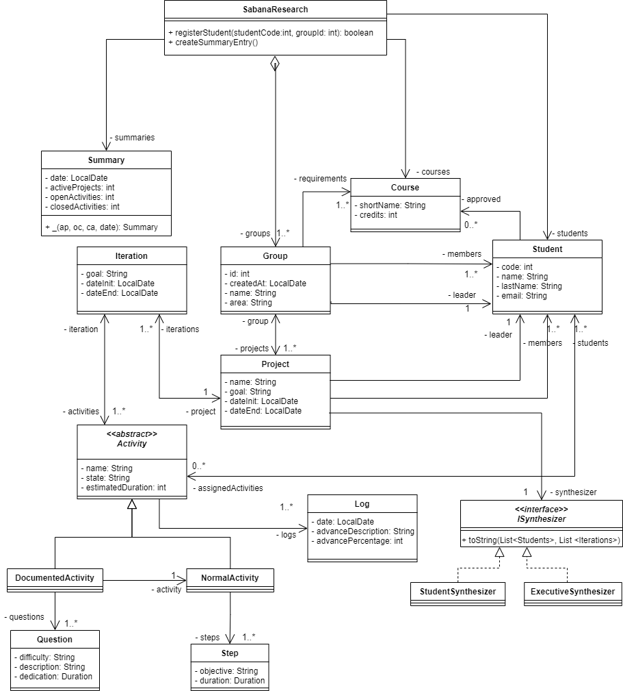
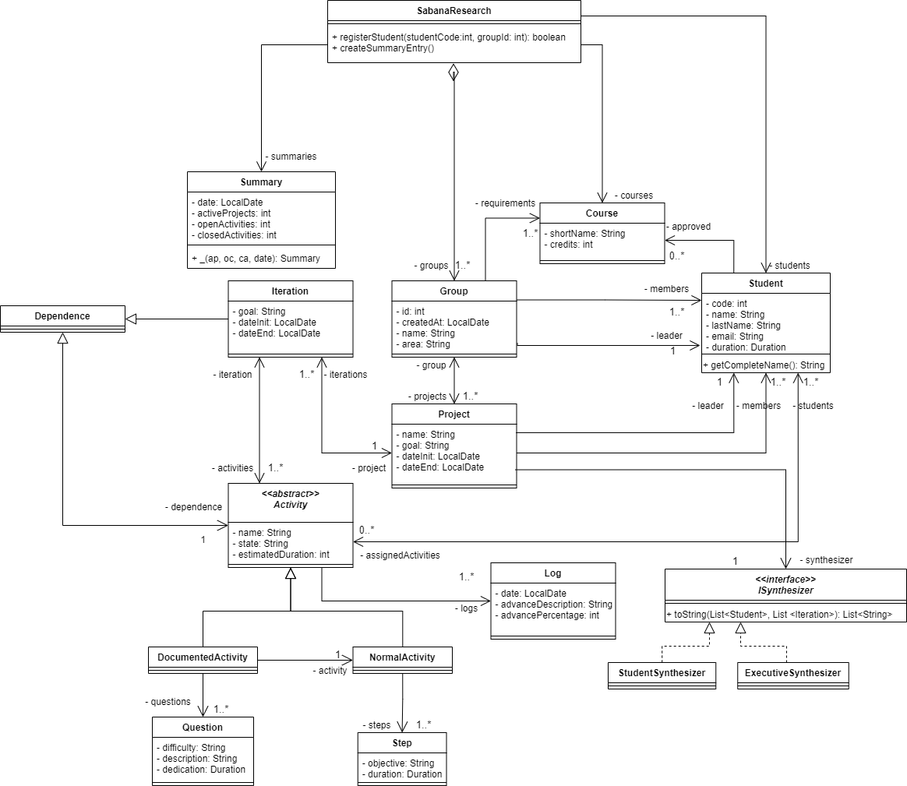

# Parcial-1
Primer parcial de POO de Santiago Santos.

# I. Memoria

* ### Mapa de memoria parte 1

* ### Mapa de memoria parte 2

* ### Mapa de memoria Completo

# III. Diseño

# IV. Conceptos
### 1. Encapsulamiento:
Encapsulamiento es mantener una información constante,
así se evita que otras clases modifiquen la información y para mantener uso
único a cada clase.

### 2. Ocultamiento
El ocultamiento es mantener la información escondida de otras clases.

# V. Bono

------------------

# POOB-TEST-SECOND-SABANA-RESEARCH

## I. (30%) IMPLEMENTANDO

## II. (25%) DISEÑANDO
1. Escriba la especificación (documentación + firma del método) del método.

public String summarize()
* Este método recopilará el resumen del tiempo total de trabajo del proyecto, así como el tiempo de cada estudiante en 
el proyecto y el tiempo que tuvo cada itineración en un String.
  
2. Construya el diagrama de secuencia.
   

3. Actualice el diagrama de clases con los nuevos elementos (clases, métodos, atributos, relaciones).

4. Escriba la especificación (documentación + firma del método) de todos los métodos de apoyo que haya identificado.

public List<String> toString(List<Student> s, List<Iteration> i)
* Convierte la información del parametro en un A 

## III. (25%) EXTENDIENDO

1. De los diseños resultantes del punto I y II, ¿Qué debe cambiar? ¿Qué no debe cambiar?. Justifique su respuesta.

Ahora al tener una actividad o una iteración que realizar antes de comenzar la actividad, tomara más tiempo en 
realizarse. Entonces la parte I podría ser cambiada

## IV. (20%) CONCEPTOS

1. ¿Cuáles son las acciones los tres momentos importantes de las excepciones? ¿Cuál es el objetivo de cada una? 
¿Cómo se implementa en Java cada acción?.
   
Los tres momentos de las excepciones son: 
* Lanzar: Este momento es cuando se inicia una excepción en un método, sirve para mandar la excepción a todos los 
  sistemas que utilicen el método de la excepción. Para su implementación es la palabra reservada `throws`
* Propagar: Este momento es cuando se manda la excepción a los demás sistemas que utilicen el método con la excepción,
  este sirve para llevar el seguimiento de la excepción, para implementarlo se usa la palabra reservada `throw`
* Controlar: Este momento es cuando se quiere hacer alguna acción diferente al salir la excepción, sirve cuando 
se quiere retornar un valor si hay una excepción. La palabra reservada para implementarlo es `try-catch`
2. ¿Qué es sobre-escritura de métodos? ¿Por qué aplicarla? ¿Cómo impedir que se sobre-escriba un método?.

La sobre-escritura de métodos es cuando hay una relación de herencia y el hijo quiere cambiar el funcionamiento de un
método del padre. Se aplica para encapsular funcionamientos unicos para cada clase hija. Para impedir que una clase
sobre-escriba el método se usa el `final`.

## V. (50%) BONO

Implemente pruebas unitarias el código necesario para que las mismas pases sobre el método `summarize()` de la clase
`Project`, asegurese de probar el `ISynthesizer` de tipo `ExecutiveSynthesizer` y `StudentSynthesizer`, para cada uno 
sus casos de éxito y excepciones.